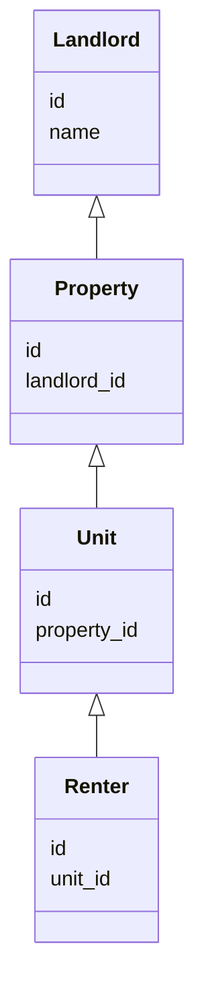

# Rental Management System (RMS)

## Overview

RMS is a multitenant rental management system designed for property owners (landlords) to manage their properties, units, and renters. Each landlord acts as a tenant in the system, with strict data separation to ensure privacy and security.

## Architecture

- **Language:** Go
- **Structure:**
  - `cmd/server/main.go`: Entry point for the server
  - `internal/domain/`: Domain logic
  - `internal/infrastructure/db/models.go`: Data models
  - `internal/presentation/`: Presentation layer
  - `internal/usecases/`: Business use cases

## Multitenancy Approach

- Each landlord is a tenant; all data is tagged with `landlord_id` for row-level separation.
- Repository and service layers enforce tenant boundaries.
- Middleware injects tenant context from authentication/session.
- Optional: Use database row-level security for additional protection.

## Domain Model



## Setup Instructions

1. Clone the repository
2. Install Go (>=1.18)
3. Configure your database (PostgreSQL recommended)
4. Build and run the server:
   ```bash
   go build -o rms-server ./cmd/server
   ./rms-server
   ```

## API Documentation

- **Authentication:** Required for all endpoints; provides tenant context.
- **Endpoints:**
  - `/landlords` - Manage landlords
  - `/properties` - Manage properties
  - `/units` - Manage units
  - `/renters` - Manage renters
- All endpoints require and enforce `landlord_id` for data separation.

## Security & Data Separation

- Row-level separation via `landlord_id` in all models
- Service layer checks for tenant boundaries
- Optional: Database row-level security (RLS)

## Contribution Guidelines

1. Fork the repository
2. Create a feature branch
3. Write clear, tested code
4. Submit a pull request with a detailed description

## License

MIT
